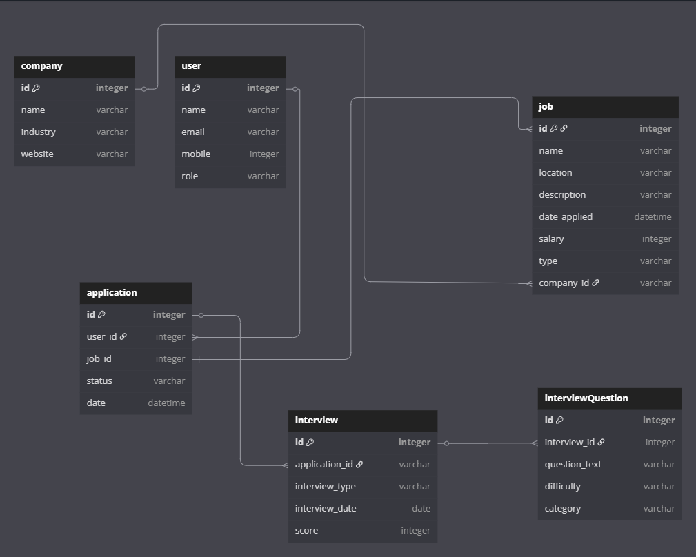

# SwipeMatch CLI App
The SwipeMatch CLI App allows users to search and track job applications likewise allows companies to list jobs openings.

## Features
1. User Management Features
- Create User: create-user
Register new users (applicants/employers) with name, email, mobile, and role.

- List Users: list-users
View all users in a table format.

- Fetch User: fetch-user
Display detailed profile of a specific user.

- Update User: update-user
Modify user details (name, email, mobile, role).

- Delete User: delete-user
Remove a user (with confirmation prompt).

- List User Applications: list-user-applications
Show all job applications submitted by a user.

2. Company Management Features
- Create Company: create-company
Add new companies with name, industry, and website.

- List Companies: list-companies
View all companies in a table.

- Fetch Company: fetch-company
Show detailed company profile.

- Update Company: update-company
Edit company details (name, industry, website).

- Delete Company: delete-company
Remove a company (with confirmation).

3. Job Management Features
- Create Job: create-job
Post new job listings (title, description, salary, type, company).

- List Jobs: list-jobs
Display all jobs with company info.

- Fetch Job: fetch-job
Show detailed job description and metadata.

- Update Job: update-job
Edit job details (title, salary, location, etc.).

- Delete Job: delete-job
Remove a job listing (with confirmation).

4. Application Tracking Features
- Create Application: create-application
Submit a job application (user + job + status).

- List Applications: list-applications
View all applications with user/job details.

- Fetch Application: fetch-application
Show detailed application status and metadata.

- Update Application: update-application
Modify application status (e.g., "applied" → "interview").

- Delete Application: delete-application
Withdraw an application (with confirmation)

## Installation
1. Clone the Repository
```bash
    git clone https://github.com/dennissammy77/swipematchcliapp.git
    cd swipematchcliapp
```

2. Set Up a Virtual Environment
```bash
    python3 -m venv venv
    source venv/bin/activate
```

3. ```pip install Pipfile```

4. Run Migrations
```bash
    cd lib
    alembic upgrade head
```

5. Seed data
On project root
```bash
    python lib/seed.py
```

6. Run the main CLI 
```bash
    python app.py
```

## Testing
Run all tests:
```bash
    pytest
```
Tests are located in the `lib/testing/` directory.

swipematchcliapp/
│── app.py                  # Entry point for CLI
├── lib/
│   ├── seed.py             
│   ├── models.py
│   |── __init__.py
│   ├── migrations/
│   |   |── __init__.py
│   │   ├── versions/
│   │   └── env.py
│   └── testing/
│       ├── company_test.py
│       ├── user_test.py
│       ├── job_test.py
│       └── application_test.py
├── Pipfile
├── README.md


# Database Schema

link to schema [https://dbdiagram.io/d/swipematchhired-68345fa56980ade2eb6a7dc0](https://dbdiagram.io/d/swipematchhired-68345fa56980ade2eb6a7dc0)

# Demo Link
[Demo link](https://drive.google.com/file/d/1OCnNu6W3FBfqvoQ4pcK93FC_OlaMLdR2/view?usp=drive_link)

# Future Endevours
Implement Interviews and interview questions.